# 🛍️ Nexo Ecommerce

Полнофункциональный e-commerce проект, построенный с использованием современных технологий. Поддерживает просмотр товаров, корзину, оформление заказа с оплатой через Stripe, регистрацию/авторизацию, фильтрацию и даже мини-игру — колесо фортуны!

## 🚀 Live Demo

<p align="center">
  <a href="https://nexo-eccomerce.vercel.app">
    
  </a>
  <br />
  <a href="https://github.com/Bogdan-Afanasev/nexo-ecommerce">
    
  </a>
</p>

## 🎞️ Demo (GIF)

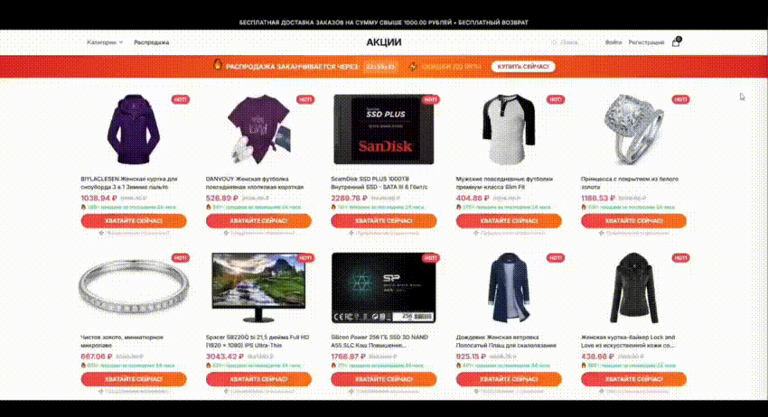

## ✨ Функции

- Просмотр товаров и подробной информации о них
- Добавление товаров в корзину
- Оформление и оплата заказа через Stripe
- Регистрация и авторизация пользователя
- Админ-панель для управления товарами (через Sanity)
- Колесо фортуны для рандомных скидок
- 🔍 Поиск товаров по названию
- 🗂️ Сортировка и фильтрация по категориям

## ⚙️ Технологии

- **Next.js 15**, **React 19**
- **Tailwind CSS**
- **Prisma + PostgreSQL**
- **Stripe** (оплата)
- **Sanity** (CMS)
- **Vercel** (хостинг)

## 🧠 Поиск и фильтрация

| Поиск                         | Категории                         |
| ----------------------------- | --------------------------------- |
| 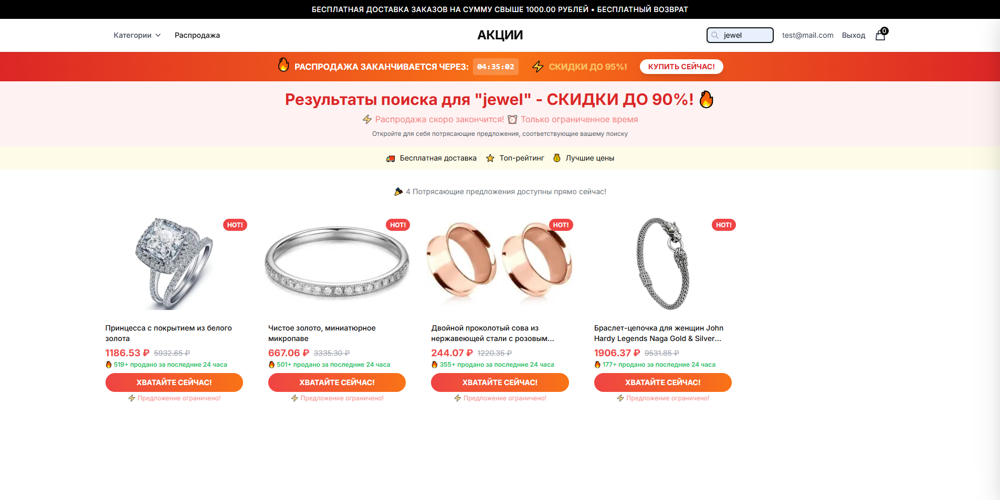 |  |

> Пользователь может ввести название товара или выбрать нужную категорию, чтобы быстрее найти нужное.

## 🖼️ Скриншоты интерфейса

| Главная страница            | Страница товара                | Корзина                     |
| --------------------------- | ------------------------------ | --------------------------- |
| 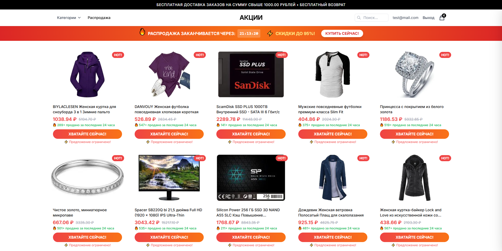 | 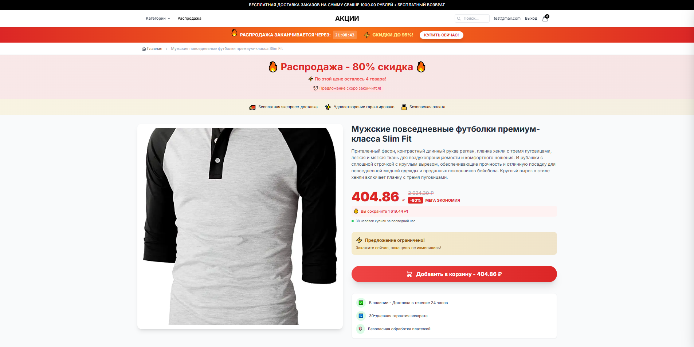 | 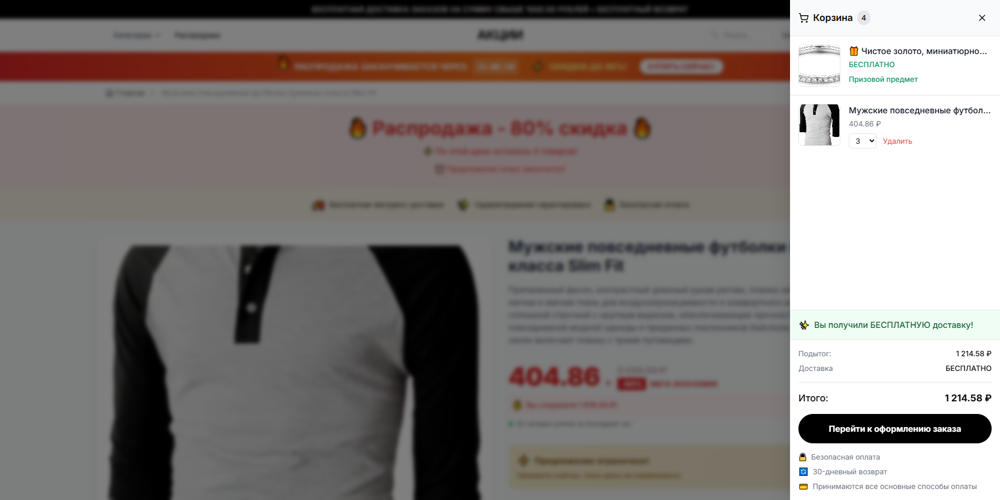 |

| Оформление заказа               | Успешная покупка               |
| ------------------------------- | ------------------------------ |
| 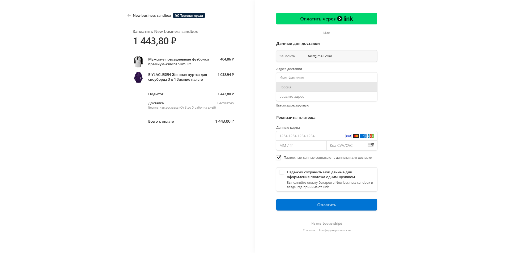 | 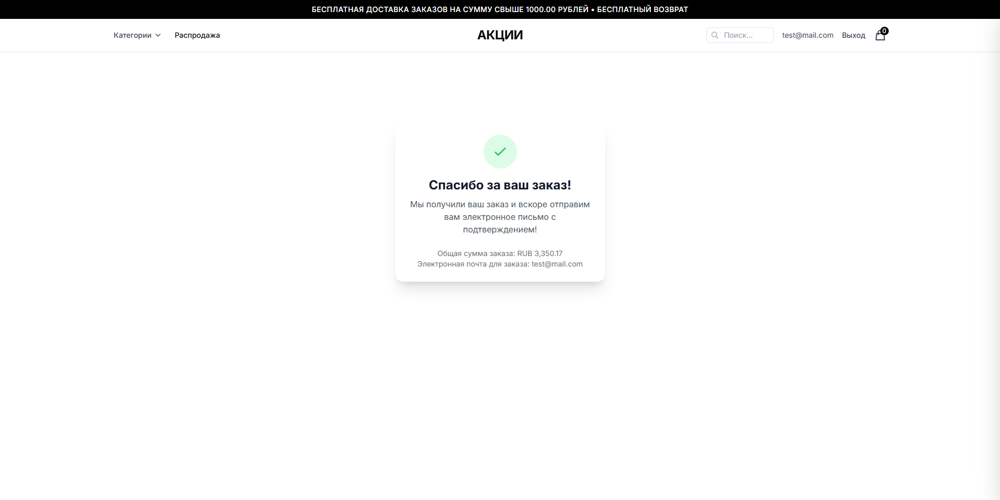 |

| Регистрация                     | Авторизация                  |
| ------------------------------- | ---------------------------- |
| 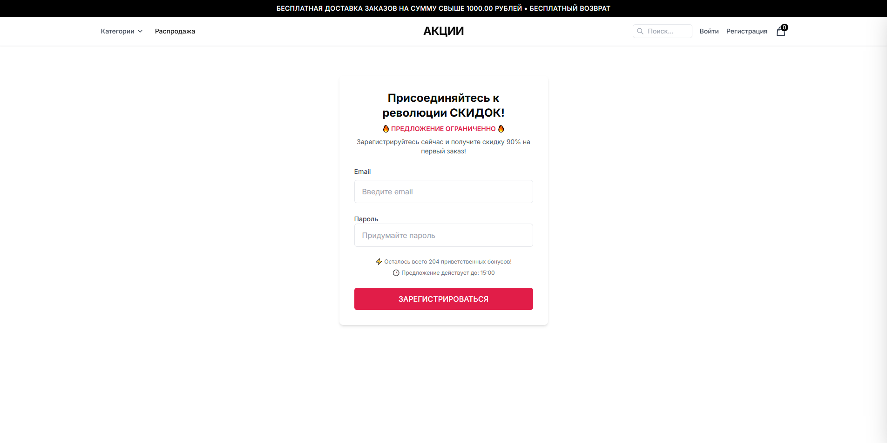 | 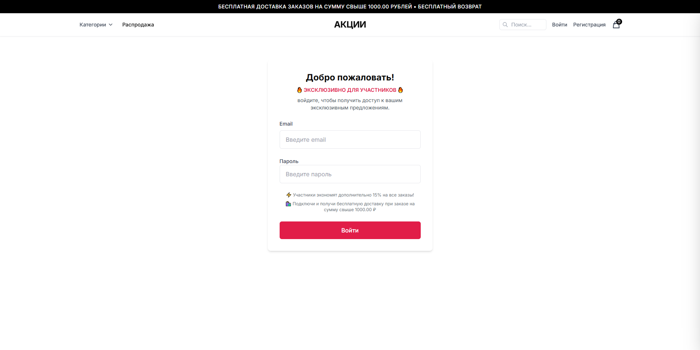 |

| Колесо фортуны                                                         |
| ---------------------------------------------------------------------- |
| 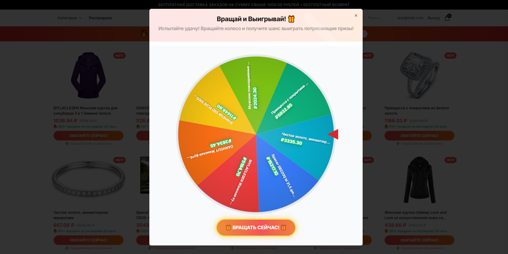 > 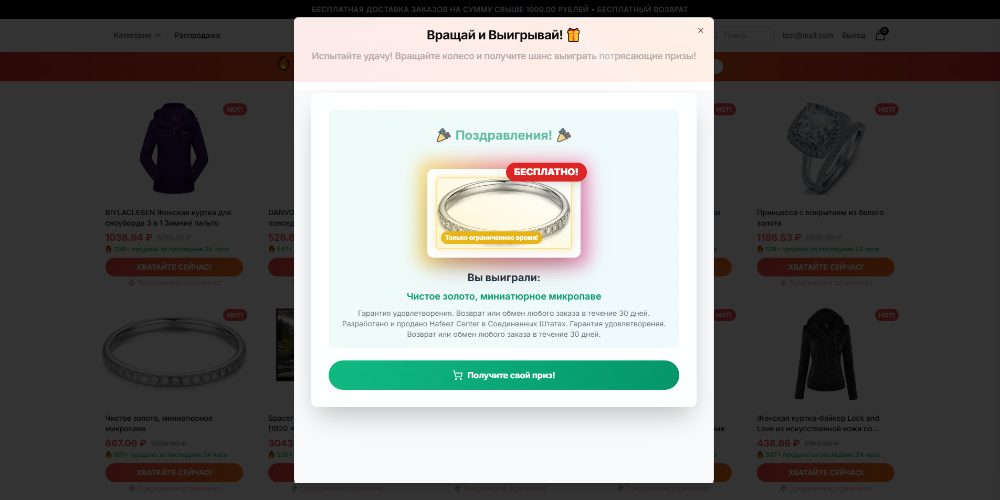 |

## 🧪 Локальный запуск

1. Клонировать проект:

```bash
git clone https://github.com/Bogdan-Afanasev/nexo-ecommerce.git
cd nexo-ecommerce
```

2. Установить зависимости:

```bash
npm install
```

3. Настроить переменные окружения:

```bash
cp .env.example .env
# и заполни .env своими ключами
```

4. Запустить локально:

```bash
npm run dev
```

## 🛠️ Roadmap

- [ ] Защищённая страница заказов для пользователя
- [ ] Просмотр истории заказов
- [ ] Панель управления заказами (для админа)
- [ ] Улучшение мобильной адаптивности
- [ ] Уведомления по email

## 🤝 Автор

[](https://github.com/Bogdan-Afanasev)  
**Богдан Афанасьев** — Frontend Developer / Fullstack Enthusiast / Philosopher-in-Progress  
[GitHub](https://github.com/Bogdan-Afanasev) | [Telegram](https://t.me/@bogdan-afanasev_dev) | [Email](mailto:bogdan.way.00@gmail.com)

---

## ⚖️ Лицензия

Этот проект создан исключительно в учебных целях. Все использованные API, стили, технологии, сторонние сервисы (такие как Stripe, Sanity и прочее) принадлежат их соответствующим владельцам. Проект не предназначен для коммерческого использования.

---

Наслаждайтесь — и не забудьте ⭐ звезду, если вам понравилось!
